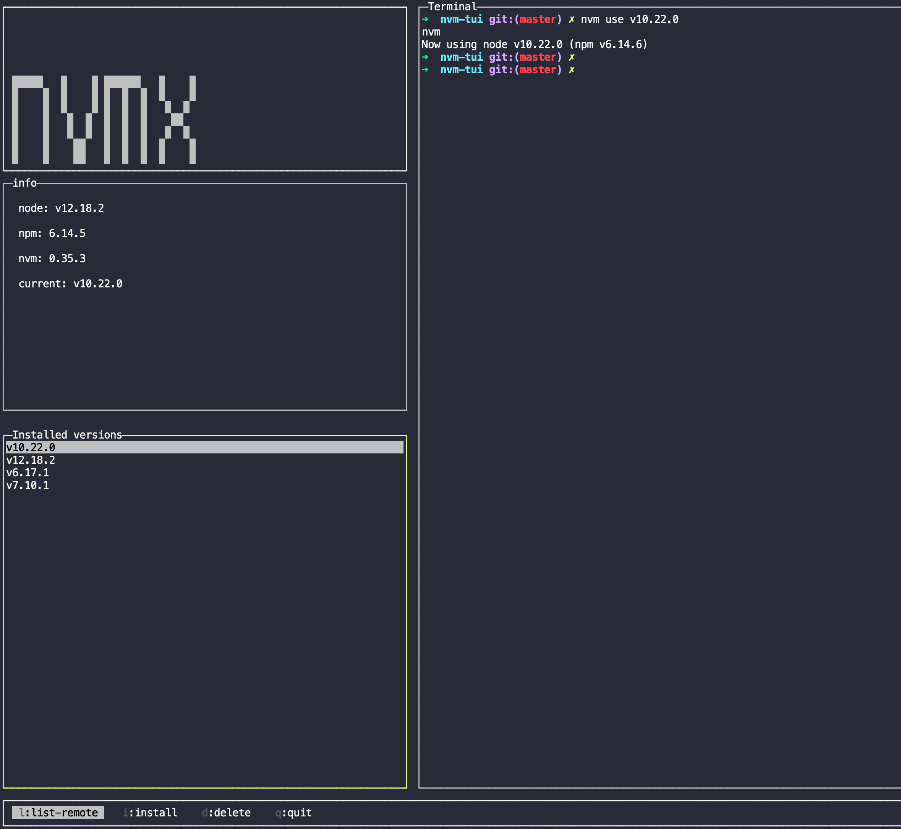
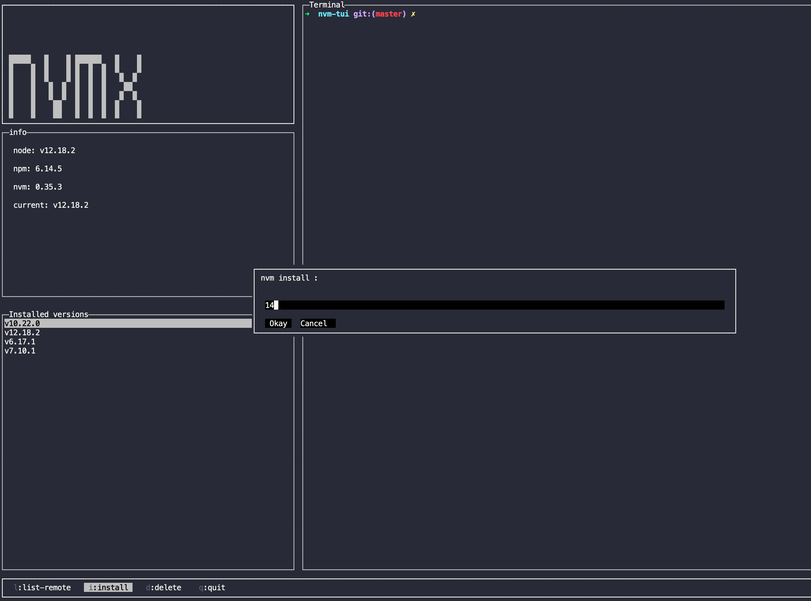

# nvm-tui


[](https://github.com/semantic-release/semantic-release)
[](https://npmjs.org/package/nvm-tui "View this project on npm")


A TUI (Terminal User Interface) for [nvm](https://github.com/nvm-sh/nvm) to save you
a few keystrokes and make you 2x productive while working with nvm.

## Features
- List installed node versions and switch to one quickly
- Install new node versions
- Uninstall node versions
- List remote versions in a separate terminal window


## Install
```
npm install -g nvm-tui
```

## Usage
```
nvm-tui
```

This library also exposes a cli in the name of `nvmx`, which is shorter to type
```
nvmx
```

You can also use npx to run:
```
npx nvm-tui
```

## Home screen


## Install screen



## Themes
If you want to load `nvm-tui` with any preferred theme you can do so by passing `--theme` option :
```
nvm-tui --theme Gruvbox-Dark
```

You can find the list of themes in [blessed-themes](https://github.com/rajasegar/blessed-themes). The default theme applied is `Dracula` which is a dark theme.
